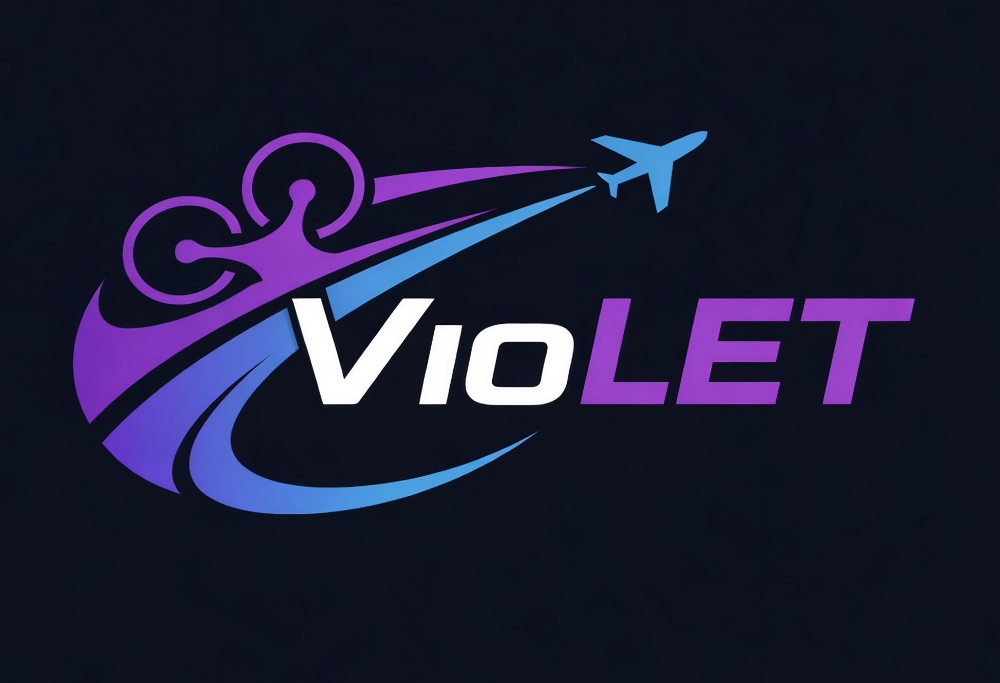

# Violet

**VioLET** is a GNC framework for autonomous multirotor and fixed-wing UAV flights based on ROS 2, PX4 stack and Gazebo. It is inspired by the work developed in the [**Pegasus Project**](https://github.com/PegasusResearch), with the objective of supporting self-learning and Master's thesis validation.
 
 

  

